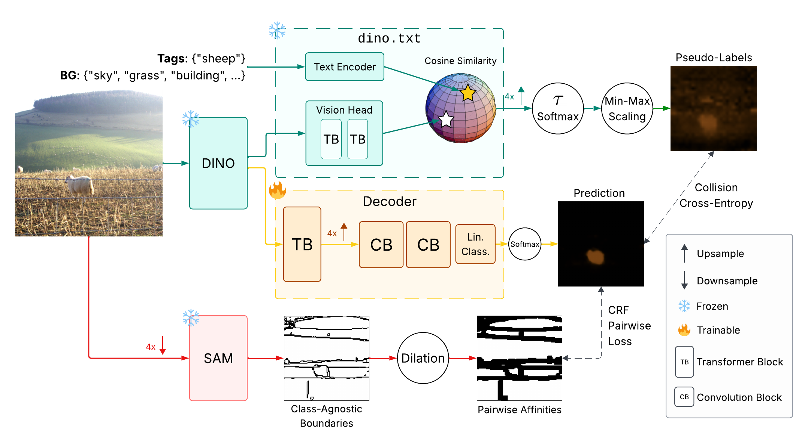

# CRF Loss is How Networks Should Learn Boundaries in Weakly Supervised Segmentation

## Overview

DS-CRF trains with a Conditional Random Field (CRF)-based loss: the per-pixel **unary** term encourages predictions to be similar to dino.txt pseudo-labels, and the **pairwise** term regularizes predictions 
using SAM boundaries.

## Results

| Dataset           | mIoU   |
|-------------------|--------|
| PASCAL VOC val   | 81.1%  |
| PASCAL VOC test   | 81.0%  |
| MS COCO val      | 56.5%  |

---
We use the models DINOv3, dino.txt, and SAM in this work.

*This repository is currently under-documented. A more complete and readable version will be added later.*
